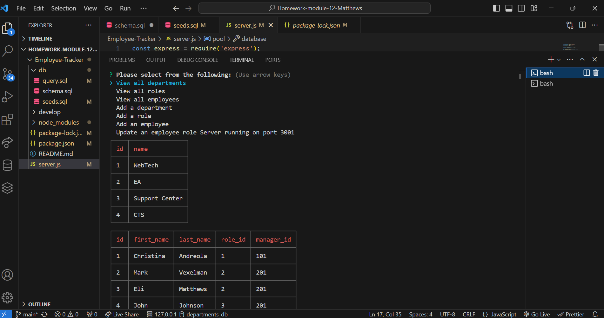

# Employee Tracker

## Table of Contents
- [Description](#description)
- [Installation](#installation)
- [Usage](#usage)
- [Licenses](#licenses)
- [Contributors](#contributors)
- [Testing](#testing)
- [Contact](#contact)
- [Video](#video-demo)
- [Screenshots](#screenshots)

## Description
This application is a demonstration of my knowledge and skills with utilizing SQL. Using the in-app terminal, you can view, add, or update employees in the SQL database.

## Installation
To install, download the github code files or clone the github repository. Run "npm i" to install the packages in the package.json file and you're ready to go!

## Usage
To use this applicaiton, run "npm start" and select the option you would like to do, then update, add, or view accordingly.

## Licenses
#### MIT License
The MIT License is an older license used to provide copyright protection.

## Contributors
Christine Matthews (Andreola)

## Testing
N/A

## Contact
#### Github: 
<a href="https://github.com/cmatthews3212">cmatthews3212</a>

#### Email: 
<a href="mailto: matthews.christinemarie@gmail.com">matthews.christinemarie@gmail.com</a>

## Video Demo
<a href="https://youtu.be/1CtnFnzQhpg">Click here to view the video demo</a>

## Screenshots
